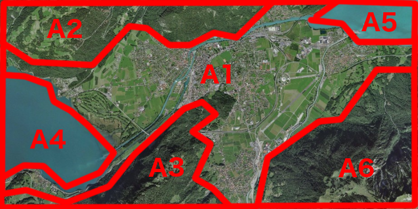
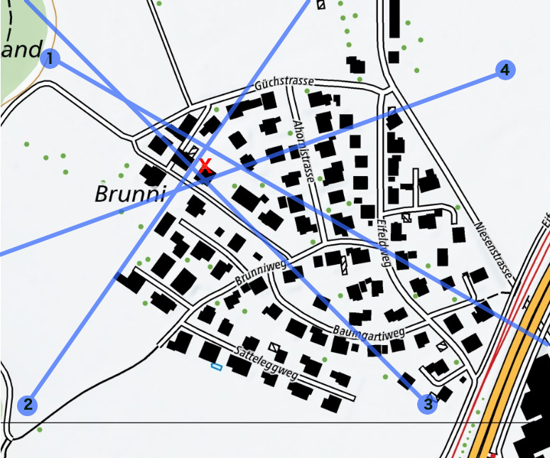
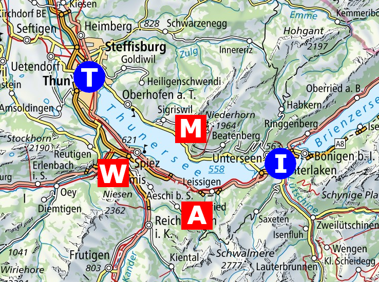
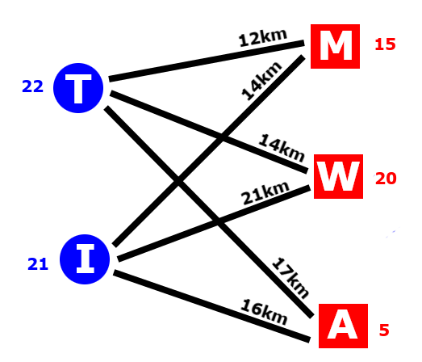
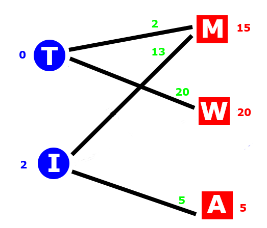
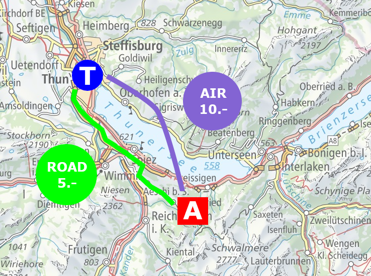
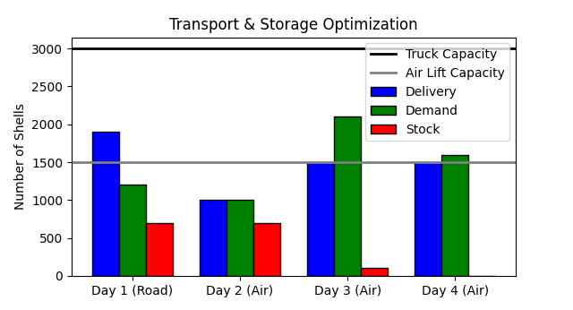
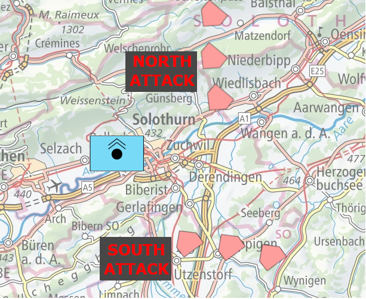
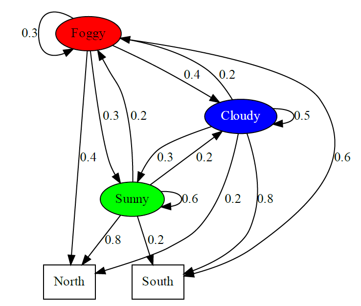

# Military Operations Research Recipes
This repository collects relevant methods in the field of military operations research. It aims to approach the topics from the application side, while reducing the theoretical background to the bare minimum.  

## Optimal Search Strategy

This method is about optimizing search efforts in order to maximize the probabilty of detecting a potential opponent.
Considering the depicted situation below, it is self-evident that the propability of presence of enemy troops is nonuniform among the given areas A1 to A6.
If the opposing force has a strong marine and mechanized infantery, there is less chance of finding anything on a steep mountain side than on urban territory.

The presented method is a numerical recipe for finding the best possible search strategy.
In particular, it will determine, respectively optimizing, the search efforts in each area A1 to A6 in order to reach the highest accumulated probability of a search success.
The applied mathematical model is derived from the <b>random search formula of Koopman</b> and results in following optimization task: 

Please note that  are the parameters to optimize and represent the search effort in time invested in the corresponding region, whereas  denotes the overall available search time.
The sensor parameters  is the <b>sweep width</b> and  the scanning speed.
 is a regions areal size and  the probability that a target might be located there. 
 is the overall probability of detection and core objective.  

Let's stick to above situation with the potential presence of tanks and battle ships.
The sweep width is  and .
The table below summarizes the properties of the regions.
|  | Type |  |    |
| --- | --- | --- | --- |
| Area 1 | urban | 14.1  | 0.55 |
| Area 2 | mountain | 6.3  | 0.05  |
| Area 3 | mountain | 4.1  | 0.05  |
| Area 4 | water | 3.5  | 0.15 |
| Area 5 | water | 1.9  | 0.15 |
| Area 6 | mountain | 9.1  | 0.05   |

Here is a [little example](code/optimal-search.py) of how such a problem can be solved by using scipy's SLSQP solver with constraints.
Note that there might exist better approaches to tackle this task.
The following table summarizes the optimal search strategies for different total search efforts of  hours.

|    | 3 hours effort | 5 hours effort | 8 hours effort | 13 hours effort |
| --- | ---  | --- | --- | --- |
| Area 1 | 2.00 h | 3.22 h | 4.45 h | 6.27 h | 
| Area 2 | 0.00 h | 0.04 h | 0.57 h | 1.40 h | 
| Area 3 | 0.00 h | 0.27 h | 0.64 h | 1.16 h | 
| Area 4 | 0.54 h | 0.84 h | 1.15 h | 1.60 h | 
| Area 5 | 0.45 h | 0.62 h | 0.79 h | 1.03 h | 
| Area 6 | 0.00 h | 0.00 h | 0.40 h | 1.56 h | 
| Optimized Detection Probability | 57.6 % | 72.4 % | 84.3 % | 93.8 % | 
| Non-optimized Detection Probability | 42.5 % | 60.3 % | 77.2 % | 90.9 % | 

Reference: Military Operations Research, Jaiswal

## Optimal Target Location

Many reconnaissance tasks in military are about localizing enemy threats. 
Not seldom these information are redundant and a good approach is to consider them all.
In the following [example](code/localization.py) it is shown how the optimal target position  is computed based on multiple sensors  on different location.
Solely the individula direction  towards the spotted target and the sensor's position  is of interest.
The optimal target position minimizes the accumulated distances to each sensor line, where the distance refers to the minimal distance  between a point and a line.

## Solving Transportation Problem

Logistics is an important aspect in military operations. 
Transporting the required equipment in an effective manner from one place to the other is, therefore, crucial. 
Following [example](code/transportation.py) depicts a simple transportation problem, in which one certain type of missile system is shipped from two depots (blue) to three destinations (red).
The optimal transportation strategy is the one requiring the least accumulated driving distance.

The figure below is a more regular way of representing such a transportation task.
The blue number next to the depot indicates the number of missile systems which are available at this base. 
The red number right of the destination is the number of systems required at this side.
The black number above the edge is the corresponding distance from the depot to the destination.

This problem can be solved by Linear Programming.
Let us assume the optimal transportation of the form , where for example the first element  holds the number of missile systems moved from deopt <b>T</b> to destination <b>M</b>, and so on.
The linear program of this particular problem looks as follows:

The obective function (accumulated distance) to be minimized

Two constraints on the depot sides

The constraints on the destination sides

Further on there is nothing like negative transportations, so

Solving [this linear program](code/transportation.py) leads to following optimal transportation process.
The green numbers denote the delivered missile systems from a depot to a destination.
The corresponding accumulated transportation distance is 566 km.

## Transportation & Storage Optimization 

This example is a more advanced version of the previous logistics problem.
Instead of a single factor, here we deal with multiple aspects.
It is assumed that during the next four days there will be heavy air attacks.
Location A is a favourable position to ramp up a mobile air defence station.
Our responsibility is the planning of a costeffective shipment of ammunition, shells, from depot T to location A, by considering following given constraints:
- At day 1, the shells can be transported on the road by truck. Maximum 3000 pieces for 5 CHF per piece.
- It is assumed that the air attacks at day 1 destroy the roads. Thus, the transportation at day 2, day 3 and day 4 are excecuted with an helicopter. Maximum 1500 pieces at a transportation price of 10 CHF per piece.
- Digging the shells' storage place and guarding the ammunition is very labour intensive, and therefore cost relevant. Storing 1 shell for 1 day costs 3 CHF. Increasing or decreasing the storage place costs 5 CHF per shell.

This optimization problem can be solved with Linear Programming. 
Here is [the actual code](code/transportStorage.py) which executes the optimization.
There are some nice tricks which are pointed out in the source.
The figure below shows the optimal logistics.

## Estimation of Next Attack 

A command headquarter in a little city is repeatedly attacked by hostile planes over several weeks.
A  retired mathematician living nearby is annoyed because of the unbearable noise and decides to take care of it.
Soon she finds out that the attacks are coming either from the South or over the mountain chain in the North.

Further on, there seems to be a pattern in the north / south attack sequence.
If yesterday's assault came from the north, today's comes likely also from the north. 
The same applies to south attacks.
She decides to visit the command headquarter and tell the soldiers about her findings. 
To her surprise a whole team is already working on this very same problem. 
There is a strong correlation between the weather at the enemy's airport and the side from which the city is attacked.
Due to limited resources the headquarter does not know the exact weather at the enemy's airport and can establish these links only retrospectively. 
The responsible soldiers have a lot of detailed knowledge but are overwhelmed with the task of combining all these aspects.
Not so the mathematician.
With the input of the soldiers and reviewing long term weather statistics she comes up quickly with a <b>Hidden Markov Model</b>.
The transition probabilities of foggy, rainy and sunny periods together with observations of previous attacks, allows an estimation for tomorrow's battle.

